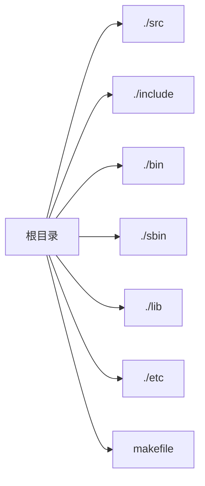

# Lesson 1 编译工具

### Linux C 

#### 工程目录的划分



1. **./src**文件夹下用于存放具体的逻辑代码
2. **/include**文件夹下用于存放宏定义，结构体定义，函数声明等
3. **./bin**文件夹下存放编译生成的可执行文件
4. **./sbin**存放外部的脚本文件
5. **./lib**用来存放库文件
6. **./etc**存放工程环境中的配置文件
7. **makefile**  管理整个工程项目编译过程中的文件

### 编译工具 GCC

#### 基本简介

Linux下的gcc(**GNU C Compiler** )是GNU推出的功能强大，性能优越的多平台编译器，是GNU的代表作之一。gcc可以在多种硬件平台上编译出可执行文件，其执行效率与一般的编译器相比平均效率要高20%~30%.

GCC编译器能将C,C++语言源程序、汇编程序编译，链接成可执行文件。在Linux系统中，可执行文件没有统一的后缀，系统从文件的属性来区分可执行文件和不可执行文件。

使用GCC编译程序时，编译过程可以被细分为4个阶段:

* 预处理(Pre-Processing)
* 编译(Compliling)
* 汇编(Assembling)
* 链接(Linking)

在预处理阶段，输入的是C语言的源文件，通常为***.c**。它们一般带有***.h**之类的头文件。这个阶段主要处理源文件中的**#ifdef**,**#include**和**#define**预处理命令。该阶段会生成一个中间文件***.i**,但实际工作中一般不会专门生成这种文件，若必须生成这种文件，可以使用下面的命令:

```shell
gcc -E test.c -o test.i
```

它通过对源文件test.c使用E选项来生成中间文件test.i

在编译阶段，输入的是中间文件***.i**，编译后生成汇编语言文件***s.**。这个阶段对应的gcc命令如下所示：

```shell
gcc -S test.i -o test.s
```

在汇编阶段，将输入的汇编文件***.s**转换成二进制机器代码***.o**.这个阶段对应的gcc命令如下所示：

```shell
gcc -c test.s -o tets.o
```

最后，在链接阶段将输入的二进制机器代码文件***.s**汇集成一个可执行的二进制代码文件。这一步骤，可以使用下面的示例命令完成。

```shell
gcc tets.o -o test
```

最终生成了可执行可执行文件test。

在实际开发过程中，使用gcc编译源文件时，源文件通常不止一个，这时就需要使用gcc编译多个源文件，使用如下命令即可：

```shell
gcc -o test testmain.c other1.c other2.c
```

该命令将同时编译3个源文件testmain.c,other1.c,other2.c，最后生成一个可执行文件test。

#### 文件类型

Gcc通过后缀来区别输入文件的类别：

* **.c**: 语言源代码文件
* **.a**: 是由目标文件构成的库文件
* **.h**: 头文件
* **.i**: 是已经预处理过的C源代码文件
* **.o**: 是编译后的目标文件
* **.s**: 是汇编语言源代码文件

#### 编译选项

Gcc编译器的编译选项大约有100多个，其中常用的几个如下：

* **-o output_filename**：确定可执行文件的名称为**output_filename**，同时这个名词不能喝源文件同名。如果不给出这个选项，gcc就给出预设的可执行文件a.out
* **-c **: 只编译，不链接成为可执行文件，编译器只是把输入的**.c**文件生成**.o**目标文件
* **-g**: 产生调试工具所必要的符号信息，要想对编译出的程序进行调试，就必须加入这个选项。

在C语言程序中，头文件被大量使用。一般而言，C程序通常由头文件(header files)和定义文件(defination files)组成。头文件是一种包含函数原型声明、常量定义的文件，用于保存程序的声明。

C程序中包含头文件有两种方法:

1. `#include <myinc.h>`
2. `#include "myinc.h"`

对于第一种，编译器gcc在系统预设包含文件目录中查找相应的头文件，而第二种，编译器gcc首先在当前目录中查找头文件，如果当前目录中没有找到需要的头文件，就到指定的dirname目录中去寻找。

#### 举例

`vim hello.c`

~~~c
#include <stdio.h>
 int main()
 {
     printf("Hello World\n");
     return 0;
 }
~~~

编译运行下面这段程序

~~~shell
$ gcc hello.c -o hello
$ ./hello
~~~

结果生成一个名为hello的可执行文件，并输出`Hello World!`

# Lesson 2  调试工具

### GDB调试工具

#### 举例

完成一个以下功能的工程代码：

1. 生成一个包含加减函数的静态库
2. 生成一个乘除函数的动态库
3. 程序主函数中通过调用动态库中的加减乘除函数计算100和5的四则运算结果，并通过调用静态库中的打印函数

# Lesson3 网络编程

### Socket

#### 基本介绍

Socket被翻译为“套接字”，他是计算机之间进行通信的一种约定或一种方式。通过socket这种约定，一台计算机可以接收其它计算机的数据，也可以向其它计算机发送数据。

socket 的典型应用就是 Web 服务器和浏览器：浏览器获取用户输入的URL，向服务器发起请求，服务器分析接收到的URL，将对应的网页内容返回给浏览器，浏览器再经过解析和渲染，就将文字、图片、视频等元素呈现给用户。接下来，服务器进程开始等待客户连接到这个命名套接字，调用listen创建一个等待队列以便存放来自客户的进入连接。最后，服务器通过accept系统调用来接受客户的连接。此时，会产生一个与原有的命名套接字不同的新套接字，它仅用于与这个特定的客户通信，而命名套接字则被保留下来继续处理来自其他客户的连接。

 套接字是一种进程间的通信的方法，不同于以往介绍的进程间通信方法的是，它并不局限于同一台计算机的资源，例如文件系统空间，共享内存或者消息队列。套接字可以认为是对管道概念的扩展——一台机器上的进程可以使用套接字与另一台机器上的进程通信。因此客户与服务器可以分散在网络中。同一台机器上的进程间也可以用套接字通信。套接字是一种通信机制，客户/服务器系统既可以在本地单机上运行，也可以在网络中运行。套接字与管道的区别：它明确区分客户与服务器，可以实现将多个客户连接到一个服务器。

套接字的工作过程(服务器端)：首先，服务器应用程序通过socket系统调用创建一个套接字，它是系统分配给该服务器进程的类似文件描述符的资源，不能与其他进程共享。其次，服务器进程使用bind系统调用给套接字命名。本地套接字的名字是linux文件系统的文件名，一般放在/tmp或者/usr/tmp 目录下。网络套接字的名字是与客户相连接的特定网络有关的服务标识符。此标识符允许linux将进入的针对特定端口号的连接转到正确的服务器进程。

套接字的工作过程（客户端）：调用socket创建一个未命名套接字，将服务器的命名套接字作为一个地址来调用connect与服务器建立连接。一旦建立了连接，就可以像使用底层文件描述符那样来用套接字进行双向的数据通信。

#### 网络字节序

内存中多字节数据存储有大小端之分, TCP/IP 协议规定数据流采用大端字节序(低地址高字节)：比如16位UDP 端口号0x03e8, 低地址放0x03, 高地址放0xe8. 发送时会先发0x03, 再发0xe8.

* 小端序(little-endian)   如果0xABCD 存在地址0x100中，则0x100 存放0xCD, 0x101 中存放0xAB. (加法好加！低地址低字节)
* 大端序(big-endian)  如果0xABCD 存在地址0x100中，则0x100 存放0xAB, 0x101 中存放0xCD(低地址高字节, 大端序更容易阅读).

网络字节序(Network Byte Order)使用大端序(big-endian byte order)
主机字节序(Machine/Host Byte Order): 一般是小端序(littel-endian byte order), 但也有大端序。 如果发送到主机缓冲区的数据还是小端字节序，就需要字节序转换大端序。

为了使网络程序具有可移植性，大小端计算机上编译后都可以正常运行, 可以为以下库函数作字节序转换:

```c
#include <arpa/inet.h>
//convert values between host byte order and network byte order(both binary)
uint32_t htonl(uint32_t hostlong);
uint16_t htons(uint16_t hostshort);
uint32_t ntohl(uint32_t netlong);
uint16_t ntohs(uint16_t netshort);
```

h表示host n表示network l表示32位整数 s 表示16位整数. htonl 可以将32位的主机字节序转为网络字节序。如果主机使用大端字节序，这些参数会原样返回。

Example:

```c
b=0x0102;
a=htonl(b);
(lldb) x/4xb &b
0x7fff5fbffb78: 0x02 0x01 0x00 0x00 (小端序)
(lldb) x/4xb &a
0x7fff5fbffb7c: 0x00 0x00 0x01 0x02 (大端序)
```

>### 网络字节序与主机字节序
>
>**主机字节序**就是我们平常说的大端和小端模式：不同的CPU有不同的字节序类型，这些字节序是指整数在内存中保存的顺序，这个叫做主机序。引用标准的Big-Endian和Little-Endian的定义如下：
>
>　　a) Little-Endian就是低位字节排放在内存的低地址端，高位字节排放在内存的高地址端。
>
>　　b) Big-Endian就是高位字节排放在内存的低地址端，低位字节排放在内存的高地址端。
>
>**网络字节序**：4个字节的32 bit值以下面的次序传输：首先是0～7bit，其次8～15bit，然后16～23bit，最后是24~31bit。这种传输次序称作大端字节序。**由于TCP/IP首部中所有的二进制整数在网络中传输时都要求以这种次序，因此它又称作网络字节序。**字节序，顾名思义字节的顺序，就是大于一个字节类型的数据在内存中的存放顺序，一个字节的数据没有顺序的问题了。
>
>所以：在将一个地址绑定到socket的时候，请先将主机字节序转换成为网络字节序，而不要假定主机字节序跟网络字节序一样使用的是Big-Endian。
>
>

#### 基本的socket函数

##### socket()

###### 函数原型

```c
int socket(int domain,int type, int protocol)
```

###### 参数解释

* **doamin :** 即协议族。常用的协议族有: **AF_INET, AF_INET6, AF_LOCAL, AF_ROUTE**等
* **type:** 指定socket类型。常用的socket类型有**SOCK_STREAM,SOCK_DGRAM,SOCK_RAM,SOCK_PACKET, SOCK_SEQPACKET**等
* **protocol:**指定协议。常用的协议有，**IPPROTO_TCP，IPPTOTO_UDP，IPPROTO_SCTP，IPPROTO_TIPC**等，它们分别对应TCP传输协议、UDP传输协议，STCP传输协议，TIPC传输协议。当protocol为0时，会自动选择和type类型对应的默认协议。

##### bind()

###### 函数原型

```C
int bind(int sockfd,const struct sockadd * addr, socklen_t addrlen);
```

###### 功能说明：

将套接字和指定的端口相连，成功返回0，否则返回-1，并置errno.

###### 参数说明：

* **sockfd:**即socket描述字，它是通过socket()函数创建，唯一标志一个socket。bind()函数就是给这个描述字绑定一个名字。
* **addr：**一个**const struct sockaddr * **指针，指向要绑定给sockfd的协议地址。这个地址结构根据地址创建socket时的地址协议族的不同而不同，如ipv4对应的是：

```c
/*在netinet/in.h中定义*/
struct sockaddr_in {
    sa_family_t sin_family;    /*address family: AF_INET*/
    in_port_t sin_port;        /*port in network byte order*/
    struct in_addr sin_addr;   /*internet address*/
}

/*Internet address*/
struct in_addr{
    uint32_t s_addr;  /*address in network byte order*/
}
```

ipv6对应的是：

```c
struct sockaddr_in6 { 
    sa_family_t     sin6_family;   /* AF_INET6 */ 
    in_port_t       sin6_port;     /* port number */ 
    uint32_t        sin6_flowinfo; /* IPv6 flow information */ 
    struct in6_addr sin6_addr;     /* IPv6 address */ 
    uint32_t        sin6_scope_id; /* Scope ID (new in 2.4) */ 
};

struct in6_addr { 
    unsigned char   s6_addr[16];   /* IPv6 address */ 
};
```

##### listen()

###### 函数原型

```c
int listen(int sockfd,int backlog);
```

###### 参数解释

* **sockfd:** 要监听的socket描述字
* **backlog: **相应socket可以排队的最大连接个数

##### accept()

###### 函数原型

###### 功能说明

accept()函数的功能是，从处于established状态的连接队列头部中取出一个已经完成的连接，如果这个队列没有已经完成的连接，accept()函数就会阻塞，直到取出队列中已完成的用户连接为止。

##### connect()

###### 函数原型

```c
int connect(int sockfd,const struct sockaddr * addr, socklen_t addrlen)
```

###### 功能说明

connect函数的第一个参数即为客户端的socket描述字，第二参数为服务器的socket地址，第三个参数为socket地址的长度。客户端通过调用connect函数来建立与TCP服务器的连接。

##### close()

###### 函数说明

在服务端与客户端建立连接之后，会进行一些读写操作，完成了读写操作就要关闭相应的socket描述字，好比操作完打开的文件要调用fclose关闭打开的文件。

```
#include <unistd.h>
int close(int fd);
```

#### 举例

##### memset()

###### 函数原型

```c
/*在string.h头文件中*/
void *memset(void *str,int c,size_t n)
```

###### 参数

* **str**    这是用来填充内存块的指针
* **c**        这是要设置的值，用这个字符取代内存块中的值
* **n**        这是要设置值得字节数

###### 返回值

这个函数返回一个指针，指向的内存区域**str**

###### 例

```c
#include <stdio.h>
#include <string.h>

int main()
{
    char str[50];
    strcpy(str,'This is string.h library function');
    puts(str);
    
    memset(str,'0',4);
    puts(str);
    
    return 0;
}

```

**运行结果：**

```
This is string.h library function
0000 is string.h library function
```


# Lesson4 网络编程

# Lesson5  多线程编程